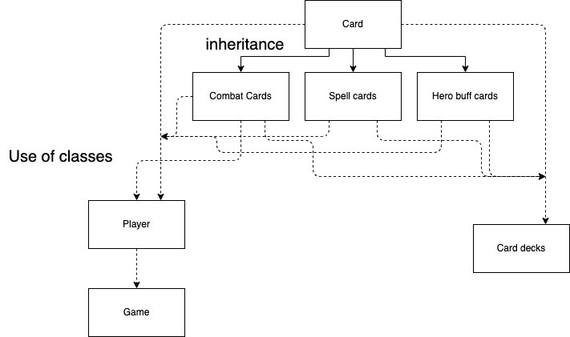

# Card RPG

## Installation

```bash
cd CardGame
make
./CardGame
```

## Usage

### Menu:

1 - start of a game player vs player\
2 - start of a game player vs computer\
3 - see all deck, create own and create new cards\
4 - load game from file\
5 - exit game

### While a game

hand var_a - use var_a card from your hand. If it is attacking or defensive, it will move from your hand to the field.
If it is spell or hero buff - it will auto uses

attack var_a var_b - a card from your hand, attack var_b card of opponent. If var_b = 0, card will attack hero.

save - save game to a file

end - end your turn.

leave - leave from game and not save it

## Shema

\
solid lines - inheritance\
dashed lines - use \
\
Combat cards, Spell cards, Hero buff cards inherited from Card

Player use Combat cards and Card (pointer on them, in which pointer saved Combat cards, Spell cards or Hero buff cards)

Game uses Player class

Card deck use pointer on Card to store all Cards (in pointers saved Combat cards, Spell cards or Hero buff cards)

## Documentation

### Card.h


    Class Card
        Fields:
            -name
            -type of card
            -cost in mana
        
        Methods:
        
            setters(name,type,mana)
        
            getters(name,type,mana)
    
            virtual getValue - get value from comb card, spell or hero buff card
        
            virtual clone
    
            // write into file information about card
            void writeCard(std::ostream &) const
        
            // read from file information about card
            Card *readCard(std::ifstream &) 
    
            // output to ostream information about card
            void displayCard(std::ostream &) const
    
            // users input new card from istream
            Card *inputNewCard(std::istream &, std::ostream &)
    
            // write main information (name, mana, type) to file
            writeCardIntoFile(std::ostream &) const
    
            // display main information (name, mana, type) to ostream
            displayMainCard(std::ostream &) const
    
    Non class methods

    //read name from file
    std::string readNameOfCard(std::ifstream &)

    //read mana from file
    int readManaOfCard(std::ifstream &)

    //read type from file
    Card::class_of_card readType_of_classOfCard(std::ifstream &)

    //users input name of new card from istream
    std::string inputNameOfCard(std::istream &, std::ostream &)

    //users input mana of new card from istream
    int inputManaOfCard(std::istream &, std::ostream &)

    // reead string from istream and try to convert it into int. return false if there are error
    bool inputCorrectNumber(int &, std::istream &)

### Combat_card.h, Spell.h, Hero_buff_card.h  - inh from Card

    Class Combat_card, Spell_card, Hero_buff_card
    
        Fields:
            -value (for comb_card - it is attack, for spell and hero_buff - value of card)
            -hp (only for Combat_card)
            -if_target (only for Spell_card)

        Methods:

            setters(name,type,mana)

            getters(name,type,mana)


### CardDecks.h 

    Class All_cards

        Fileds:
            
            -vector of pointer on Card

        Methods:

            // call, when user want to create new card
            bool createNewCard()

            //output all cards on screen
            void displayCards()

            //get card under with number ...
            Card *getCard(int)

            //get how many cards
            long unsigned int getSize();
    
    Class All_decks:
        
        Fields:

            -vectors of all decks(in each deck 30 cards)
            
            -All_cards

        Methods:
        
            //create new deck of 30 already existed cards
            void createNewDeck();

            //output all decks on screen
            void displayDecks();

            //get deck under number ...
            std::vector<Card *> getDeck(int);
            
            //get number of decks
            long unsigned int getSize();
    
    
### Player.h

    Class Player

        Fields:
        
            - vector of combat cards - player cards on filed

            - vector of pointers on Cards - player cards in hand

            - vector of pointers on Cards - player stack

            - hp, weapon, armor, current mana, max capp of mana

            - if player is computer or not
        
        Methods

            setters
        
            getters

            operator ==
            
            //check of player password
            bool checkPassword(std::string);

            //player get damage
            void takeDamage(int);
                
            //if player still alive (hp > 0)
            bool ifPlayerAlive();
                
            //kill players unit on filed under number ...
            void killUnit(int);

            //move combat  card from hand to filed (play combat_card from hand) 
            void fromHandToField(int);

            //damage players unit under number ... on filed by value
            void damageOnUnit(int, int );

            //heal unit on players under number ... filed by value
            void healOnUnit(int, int);
    
            //use spell (simply delete spell card from hand)
            void useSpellCard(int);

            //use hero card and uses its buff
            void useHeroCard(int);

            //if you use combat card - set it unplayable
            void setCardNotPlayable(int);

            //increase mana by 1, move 1 card from stack to hand
            void prepareForRound();

            //set default values, move first 3 cards from stack to players hand
            void initGame();

            //write inf about player into file
            void savePlayer(std::ostream &) const;
        
            //read inf about player from file
            void loadPlayer(std::ifstream &);

### Game.h

    Class Game
        
        Fileds:

            -Player1
            
            -Player2

            -which turn
    
        Methods:

            getters

            setters

            //run the game
            void run()
        
            //if player human. player and his opponent
            bool humanRound(Player &, Player &);
        
            //if player is computer. computer and opponent (human)
            bool computerRound(Player &, Player &);

            //call menu for checking players password
            void checkingPassword(Player &);
        
            //display game status
            void printInformation(Player &, Player &);
            
            //display player hand cards
            void printPlayerHandInformation(Player &);
            
            //display player status
            void printPlayerInformation(Player &);
            
            //player play card under number ... from hand
            void playCardFromHand(Player &, Player &, long unsigned int);
            
            //player attack by card from filed under number ... and attack opponent card on field under number ...
            //or attack hero, if target = -1
            static void playCardFromField(Player &, Player &, long unsigned int, int );
            
            //call save menu into file
            void saveTheGame();
            
            //call menu for load game from file
            void loadTheGame();
        
### Menu.h

    //init main menu
    void mainPage();